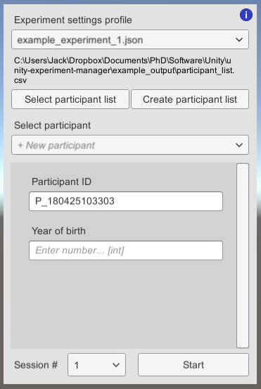

# ExpMngr - Experiment Manager for Unity
A set of C# scripts which simplifies management of human-based experiments developed in Unity. This is the example project, see Releases for latest Unity Package.

## Features

### Programming style

* Classes for common experimental concepts such as `Session`, `Block` & `Trial`
* Helps create maintainable and readable code using an Object-Oriented Programming style

### Data collection

ExpMngr automates the process of collecting behavioural and movement data. **Behavioural data** is collected with 1 row per `Trial`, and automatically records some values such as the timestamp of the start and end of the trial.
**Movement data** is the position and rotation of any object in the scene, which is captured at whatever frame rate the application is running at (in the `Update()` loop) by adding a `Tracker` component to a GameObject. This can be used to track positions of user controlled objects (such as hands or head in a virtual reality application) or an arbitrary object in the scene (e.g. some kind of stimuli). 
Data is stored in CSV files with automatic handling of file & directory naming.

### Events

A `UnityEvent` is invoked on `Trial` begin and end, allowing you to easily trigger presentation of stimuli at trial start (for example).

### CSV Participant List

A participant list feature is used allowing experimenters to optionally pre-prepare participant information. Additionally, this participant list is shared between experiments, allowing cross comparison of observations within participants.  

### Settings system

The settings is cascading, allowing setting independent variables at a `Session`, `Block`, or `Trial` level. Settings profiles can be stored as `.json` files and selected via the UI. This allows experimenters to deploy a single build of the experiment with several sub-experiments defined in settings profiles. The data for these sub-experiments is stored independently.   

### UI

A UI is available to load participant data from file (or add new participant data). Variables that are collected are customisable and can be used in the experiment (e.g. a parameter for a participant's age could be used to change the difficulty of the experiment).



### File IO

Files are read and written in a separate thread to avoid frame drops, which can induce motion sickness in VR HMDs.

## Example

```csharp
class ExperimentBuilder : Monobehaviour
{
    // set this to your ExperimentSession instance in the inspector
    public ExpMngr.ExperimentSession exp;
    
    // call this function from ExperimentSession OnSessionStart UnityEvent in its inspector
    public void GenerateAndRun() 
    {
        // Creating a block
        var myBlock = new ExpMngr.Block(exp); 

        // Creating 10 trials within our block
        for (int i = 0; i < 10; i++)
            new ExpMngr.Trial(myBlock);

        // Add a new setting to trial 1
        var firstTrial = myBlock.GetTrial(1);//trial number is not 0 indexed
        firstTrial.settings["color"] = "red";

        // Run first trial
        exp.nextTrial.Begin();
    }

    ...

}
```

See `Assets/ExpMngr/ExampleScript.cs` for another simple example.

## Documentation

(incomplete)
http://jackbrookes.github.io/unity-experiment-manager

## Get started

Download the project folder and open in Unity. Alternatively import the latest ```.unitypackage``` [release](https://github.com/jackbrookes/unity-experiment-manager/releases) to your existing Unity project.

Note: Users must change API Compatibility Level to .NET 2.0 in Unity player settings. 

## Future additions

* In experiment UI to monitor collection of data in real-time
* Better documentation and examples
